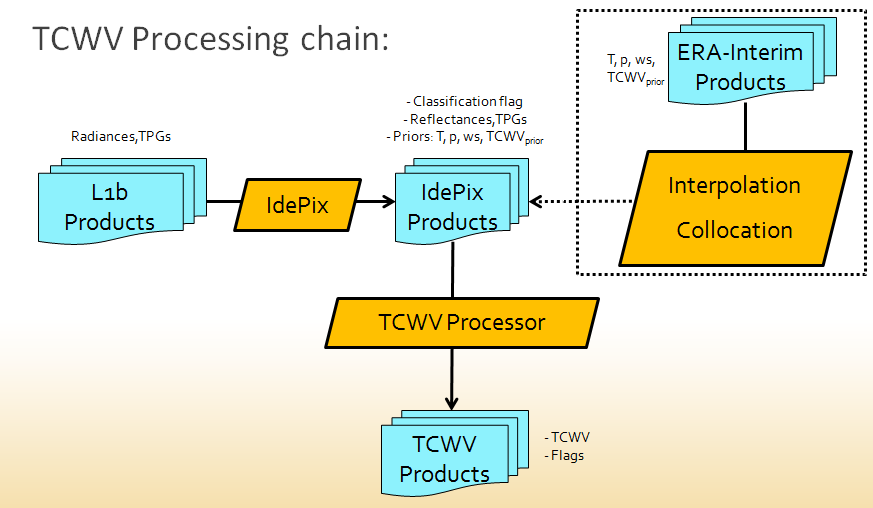
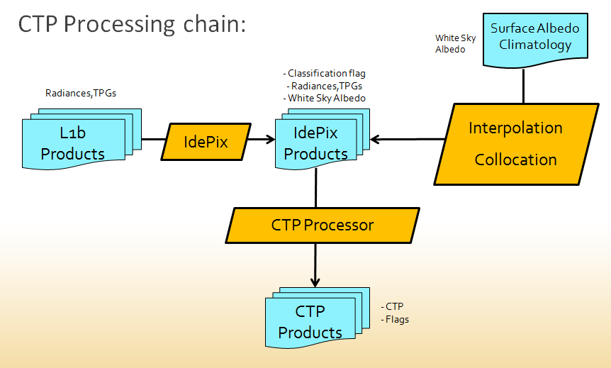

.. role:: underline
    :class: underline

.. index:: SNAP Cawa TCWV and CTP Processing System

.. _cawa_processing_system:

============================================
The SNAP Cawa TCWV and CTP Processing System
============================================

Overview
========

The key goal of the CAWA project regarding software development, production and dissemination was to
implement the proposed algorithms for TCWV and CTP in free and easily accessible open source toolboxes, notably and
foremost ESA’s SNAP toolbox. After successful implementation, TCWV and CTP datasets from the full MERIS archive were
generated with BC's 'Calvalus' Linux cluster following the project targets. In addition, TCWV from several months
of 'OLCI-like' input datasets (i.e. MODIS Aqua/Terra products MOD021 and MYD021) were generated. However, the SNAP
TCWV and CTP processors are in principle fully portable and can be run on any Linux platform. The procedure for
installation and operation is described in this chapter.

.. index:: Theoretical Background Summary

Theoretical Background
======================

The motivation and theoretical background for the TCWV and CTP retrieval is summarized in the CAWA project
proposal [`1 <intro.html#References>`_].
The underlying algorithms are described in detail in the corresponding ATBDs for TCWV [`2 <intro.html#References>`_]
and CTP [`3 <intro.html#References>`_], respectively.

.. index:: Processing Environment

Processing Environment
======================

.. todo:: OD to complete

Most of the TCWV and CTP processing in the frame of the CAWA project has been carried out on BC's Linux-based
processing system
(’*Calvalus*’ = CAL/VAL and User Services), based on the so-called MapReduce (MR) programming model, combined with a
distributed file system (DFS). Calvalus uses *Apache Hadoop*, which is a Java open source implementation of MR and DSF.
It gains its performance from massive parallelization of tasks and the
:underline:`data-local execution of code`, which avoids expensive network traffic.
Actually the Calvalus system has ~90 cores, ~ 1 PetaByte data storage volume. It is extensively used within various
projects.

However, as said, the SNAP TCWV and CTP processors can in principle be set up and run on every Linux based computing systems.
This is described in more detail in section :ref:`cawa_processor_installation`.

.. index:: Processor Components

Processor Components
====================

The SNAP TCWV and CTP processing system consists of the following SNAP software components:

- *snap-core* module
- *snap-gpf* module
- *snap-python* module
- *snap-netcdf* module
- *s3tbx-idepix* module
- *snap-cawa* plug-in
- *snap-cawa-io* plug-in

These components are described in more detail in the following subsections.

The Sentinel Application Platform (SNAP)
----------------------------------------

A common architecture for all Sentinel Toolboxes is being jointly developed by Brockmann Consult, Array Systems
Computing and C-S called the Sentinel Application Platform (SNAP).

The SNAP architecture is ideal for Earth Observation processing and analysis due to various technological
innovations as well as approved concepts from the BEAM toolbox. Most of the software components listed above make
use of various SNAP core capabilities.

A good starting point for much more detailed information is the SNAP homepage [`4 <intro.html#References>`_], and also
the comprehensive help documentation integrated in the SNAP desktop application.

The SNAP Graph Processing Framework
-----------------------------------

One of the key components in SNAP is the Graph
Processing Framework (GPF) for creating user-defined processing chains. Both CAWA TCWV and CTP processors make use of this
framework.

Within SNAP, the term data processor refers to a software module which creates an output product from one or more
input products configured by a set of processing parameters.
The GPF framework was originally developed for BEAM.
Since the early days of BEAM, a number of data processors have been developed; some of them are standard modules while others
are contributed by 3rd parties. All of these data processors have been developed using a dedicated processing
framework which was already part of the first version of BEAM.

Based on the experience collected within a number of projects, the SNAP authors have developed what is now the
SNAP Graph Processing Framework.
The GPF provides all the features inherited from BEAM, but adds a number of new ones for developers and
reduces the amount of source code to write while drastically improving its readability and maintainability.

Much more detailed information on the SNAP GPF is provided by
the specific GPF help documentation integrated in the SNAP desktop application.

The SNAP-Python Interface (SNAPPY)
----------------------------------

A new concept provided in SNAP is the possibility to develop preocessing scripts using Python. This is realized by a new
SNAP-Python extension (SNAPPY). This component basically provides a bi-directional communication between Python and Java
since the Python extension code must be able to call back into the Java APIs.
This communication is realized by the bi-directional Python-Java bridge ‘jpy’, which comes with a number of outstanding
features, such as

- Fully translates Java class hierarchies to Python
- Support of Java multi-threading
- Fast and memory-efficient support of primitive Java array parameters (e.g. NumPy arrays)

The jpy Python module is entirely written in the C programming language. The same resulting shared library is used as
a Python jpy module and also as native library for the Java library (*jpy.jar*). This means that

- Python programs that import the ‘*jpy*’ module can load Java classes, access Java class fields, and call class
  constructors and methods.
- Java programs with *jpy.jar*  on the classpath can import Python modules, access module attributes such as class
  types and variables, and call any callable objects such as module-level functions, class constructors, as well as
  static and instance class methods.

SNAPPY can also be used from the Graph Processing Framework so that in SNAP scientific
GPF operators can be developed not only in Java, but now also in Python. In CAWA, both TCWV and CTP processors
are making use of this and were written in Python, whereas the pre-processing (i.e. the IdePix pixel classification)
uses a GPF processor which was written in Java.

More detailed information on SNAPPY can be found in [`5 <intro.html#References>`_].

The SNAP-NetCDF Module
----------------------

The SNAP NetCDF module provides comprehensive capabilities for NetCDF file I/O within SNAP, based on the set of NetCDF
software packages provided by UCAR Unidata. In return the SNAP NetCDF module is used by the *snap-cawa-io* module
which ensures a project-related generation of TCWV and CTP products in CF-compliant NetCDF format. See
section :ref:`cawa_products` for more detailed description of the CAWA TCWV and CTP products.

.. index:: Processing Flow

Processing Flow
===============

Although the TCWV and CTP processors are completely independent of each other, their individual processing flow is very
similar as shown and explained below.

TCWV Processor
--------------

The overall processing flow of the SNAP TCWV processor is shown in :numref:`tcwv_chain`.

.. _tcwv_chain:

   Processing flow of the SNAP TCWV processor.

CTP Processor
-------------

The overall processing flow of the SNAP CTP processor is shown in :numref:`ctp_chain`.

.. _ctp_chain:

    Processing flow of the SNAP CTP processor.

